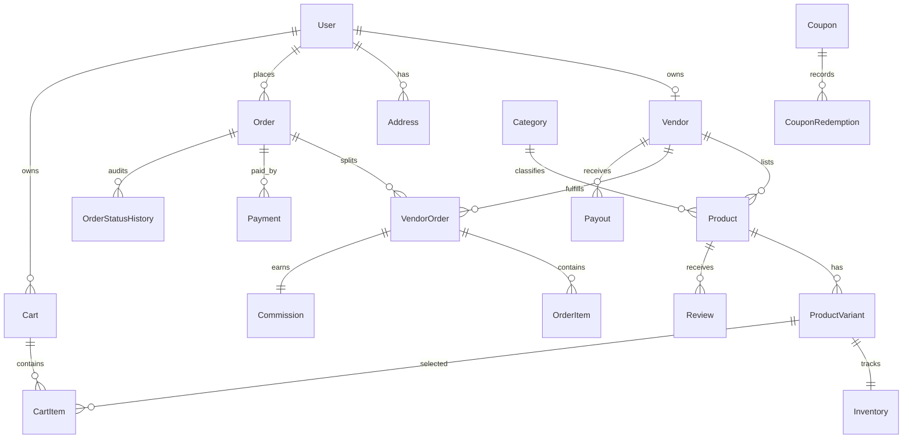

# Entity relationship overview

```mermaid
erDiagram
  User ||--o| Vendor : owns
  User ||--o{ Address : has
  User ||--o{ Order : places
  Vendor ||--o{ Product : lists
  Category ||--o{ Product : classifies
  Product ||--o{ ProductVariant : has
  ProductVariant ||--|| Inventory : tracks
  User ||--o{ Cart : owns
  Cart ||--o{ CartItem : contains
  ProductVariant ||--o{ CartItem : selected
  Order ||--o{ VendorOrder : splits
  Vendor ||--o{ VendorOrder : fulfills
  VendorOrder ||--o{ OrderItem : contains
  Order ||--o{ Payment : paid_by
  Order ||--o{ OrderStatusHistory : audits
  VendorOrder ||--|| Commission : earns
  Vendor ||--o{ Payout : receives
  Product ||--o{ Review : receives
  Coupon ||--o{ CouponRedemption : records
```

The complete constraints, indexes, cascade rules, and monetary integer fields are defined in `packages/database/prisma/schema.prisma`.
